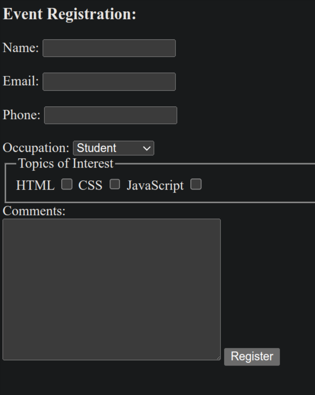
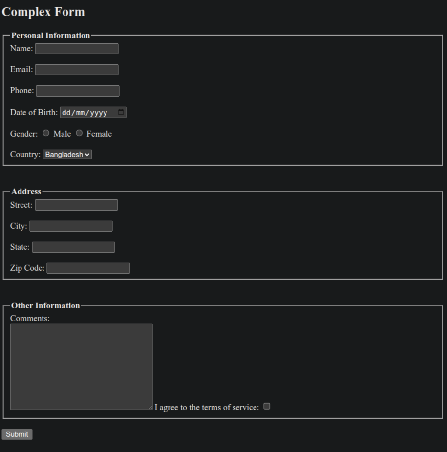

# HTML Forms: From Beginner to Pro

## Let's Code This form(Project -01) ->




### Here is the HTML code for this:

``` html
 <h3>Event Registration:</h3>
    <form>
        <label for="name">Name:</label>
        <input type="text" id="name" name="name">

        <br><br>

        <label for="emailID">Email:</label>
        <input type="email" id="emailID" name="emailID">

        <br><br>

        <label for="phoneID">Phone:</label>
        <input type="tel" name="phoneID" id="Phone">

        <br><br>

        <label for="occupationType">Occupation:</label>
        <select name="occupationType" id="occupationType">
            <option value="student">Student</option>
            <option value="professional">Professional</option>
            <option value="other">Other</option>
        </select>

        <fieldset>
            <legend>Topics of Interest</legend>
            <label for="checkbox1">HTML</label>
            <input type="checkbox" name="checkbox" id="checkbox1">


            <label for="checkbox2">CSS</label>
            <input type="checkbox" name="checkbox" id="checkbox2">

            <label for="checkbox3">JavaScript</label>
            <input type="checkbox" name="checkbox" id="checkbox3">

        </fieldset>

        <label for="textarea1">Comments:</label>
        <br>
        <textarea name="textarea1" id="textarea1" cols="30" rows="10"></textarea>

        <input type="submit" value="Register">


    </form>
```

## Let's Code another form(Project-02):


### Here is the HTML code for this :

```html
<h3>Job Application</h3>
    <form>
        <label for="name">Name:</label>
        <input type="text" id="name" name="name">

        <br><br>

        <label for="emailID">Email:</label>
        <input type="email" id="emailID" name="emailID">

        <br><br>

        <label for="phoneID">Phone:</label>
        <input type="tel" name="phoneID" id="Phone">

        <br><br>

        <label for="fileUpload">Resume:</label>
        <input type="file" name="fileUpload" id="fileUpload">

        <br><br>
        
        <label for="exp">Experience(in years):</label>
        <input type="number" name="exp" id="exp" min="0" max="50">

        <br><br>

        <fieldset>
            <legend>Skills:</legend>
            <input type="checkbox" name="checkbox" id="checkbox1">
            <label for="checkbox1">HTML</label>


            <input type="checkbox" name="checkbox" id="checkbox2">
            <label for="checkbox2">CSS</label>

            <input type="checkbox" name="checkbox" id="checkbox3">
            <label for="checkbox3">JavaScript</label>
        </fieldset>

        <br><br>

        <label for="hEdu">Highet Education:</label>
        <select name="hEdu" id="hEdu">
            <option value="associate's degree">Associate's Degree</option>
            <option value="bachelor's degree">Bachelor's Degre</option>
            <option value="master's degree">Mastes's Degree</option>
            <option value="phd">PhD</option>
        </select>

        <br><br>

        <fieldset>
            <legend>Availablity:</legend>
            <!-- Here if we use same name then we can check only one one option otherwise all -->
            <label for="rd1">FUll-time</label>
            <input type="radio" name="rd" id="rd1">
            
            <br>

            <label for="rd2">Part-time</label><input type="radio" name="rd" id="rd2">
        </fieldset>

        <br>

        <label for="textarea1">Additional Comments:</label>
        <br>
        <textarea name="textarea1" id="textarea1" cols="30" rows="10"></textarea>
        <br>
        <input type="submit" value="Submit Application">
    </form>
```

## Let's Code a Complex Form (Project-03):



### Here is the HTML code for this:

```html
<h2>Complex Form</h2>
    <form>
        <fieldset>
            <legend><strong>Personal Information</strong></legend>
            <label for="name">Name:</label>
            <input type="text" id="name" name="name" />

            <br /><br />

            <label for="emailID">Email:</label>
            <input type="email" id="emailID" name="emailID" />

            <br /><br />

            <label for="phoneID">Phone:</label>
            <input type="tel" name="phoneID" id="Phone" />

            <br /><br />

            <label for="dof">Date of Birth:</label>
            <input type="date" name="dof" id="dof">

            <br><br>

            <!-- We can easily use span here -->
            <p style="display: inline;">Gender:</p>

            <input type="radio" name="gender" id="male">
            <label for="male">Male</label>

            <input type="radio" name="gender" id="female">
            <label for="female">Female</label>

            <br><br>

            <label for="country">Country:</label>
            <select name="country" id="country">
                <option value="bangladesh">Bangladesh</option>
                <option value="india">India</option>
                <option value="us">USA</option>
                <option value="uk">Japan</option>
            </select>
        </fieldset>

        <br><br>

        <fieldset>
            <legend><strong>Address</strong></legend>

            <label for="street">Street:</label>
            <input type="text" name="street" id="street">

            <br><br>

            <label for="city">City:</label>
            <input type="text" name="city" id="city">

            <br><br>

            <label for="state">State:</label>
            <input type="text" name="state" id="state">

            <br><br>

            <label for="zipcode">Zip Code:</label>
            <input type="text" name="zipcode" id="zipcode">
        </fieldset>

        <br><br>

        <fieldset>
            <legend><strong>Other Information</strong></legend>

            <label for="textarea1">Comments:</label>
            <br>
            <textarea name="textarea1" id="textarea1" cols="30" rows="10"></textarea>

            <label for="terms">I agree to the terms of service:</label>
            <input type="checkbox" name="terms" id="terms">
        </fieldset>

        <br>

        <input type="submit" value="Submit">
    </form>
```